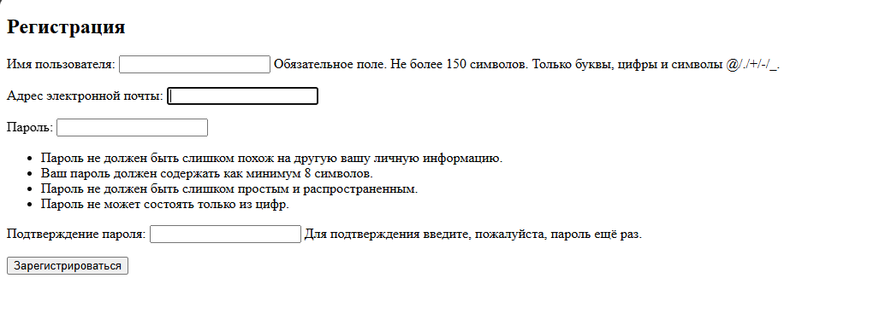
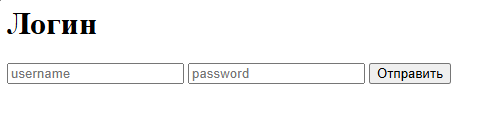

# Интернет магазин по продаже игр на джанго
## Описание
Учебный проект интернет магазина для продажи игр, написанны на фреймворке django.
## Возможности сайта
- Регистрации пользователя
- Аутентификация и авторизация пользователя
- Показ всех товаров в магазине
- Персональная страница каждого товара
## Чему я научился
- Регистрация пользователя с помощью форм django
- Поле для хранения картинки в моделях
- Настройка отображения картинок на сайте
- Подключение статичиских файлов(CSS) к Html шаблонам
- Настройка админ-панели для управления данными
- Локализация админ-панели и фильтры
## Работа сайта
### Страница со списком всех товаров 

### Карточка товара

### Регистрация пользователя

### Логин

